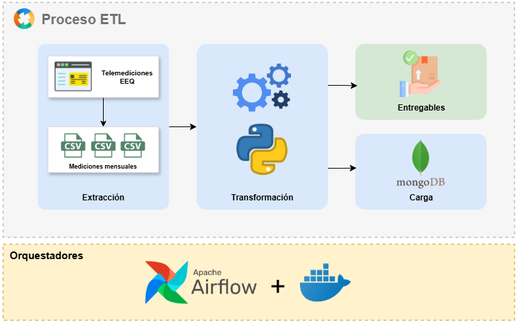
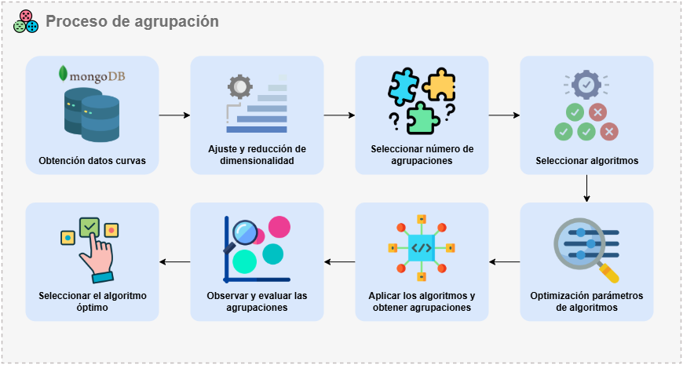

# ⚡ Agrupación de clientes no regulados del sector eléctrico según curvas de carga

Este proyecto tiene como objetivo **agrupar clientes no regulados** de una empresa distribuidora de energía eléctrica en función de sus **curvas de carga representativas**, permitiendo analizar patrones de consumo y segmentar clientes según su comportamiento energético.  

El flujo completo abarca dos fases principales: **ETL** (Extracción, Transformación y Carga) y **Agrupación** mediante algoritmos de aprendizaje no supervisado.  

---

## 🛠️ Tecnologías utilizadas

- 🐍 **Python**: procesamiento y análisis de datos.
- 🌬️ **Apache Airflow**: orquestación del proceso ETL.
- 🐳 **Docker**: contenerización y despliegue.
- 🍃 **MongoDB**: almacenamiento de datos procesados.
- 📚 **Scikit-learn** y **Pandas**: modelado y análisis de datos.

---

## 📊 Proceso ETL

El flujo ETL procesa y prepara los datos para su análisis:  

1. **Extracción**:  
   - Se unifican las **12 mediciones mensuales** (2023) de cada cliente desde archivos CSV.
   - Corrección de inconsistencias en formatos de fecha y separadores decimales/miles.

2. **Transformación**:  
   - Cálculo de **potencia aparente**:
     - Clientes con demanda activa/reactiva → teorema de Pitágoras.
     - Clientes con energía en intervalos → multiplicación por 4 para obtener potencia aparente.
   - Exclusión de **días no laborables** (fines de semana y feriados).
   - Interpolación de valores nulos mediante una función polinómica de orden 3.
   - **Escalado diario individual** para evitar que valores atípicos aplanen las curvas.

3. **Carga**:  
   - Los datos procesados y las curvas tipo se almacenan en **MongoDB**.
   - Se generan los siguientes entregables:
     - 📈 Curva tipo.
     - 📈 Curva del día de máxima demanda.
     - 📄 CSV con coordenadas de ambas curvas.
     - 📜 Archivo plano con demanda máxima y mínima para reescalado.

---

## 🤖 Proceso de agrupación

Una vez procesados los datos, se agrupan los clientes según la **forma de sus curvas tipo**:  

1. **Preprocesamiento**:
   - Ajuste de las curvas para que todas comiencen en (00:00, 0), eliminando desplazamientos en eje Y.

2. **Modelado**:
   - Algoritmos usados:  
     - 📍 *KMeans*
     - 📍 *Gaussian Mixture*
     - 📍 *Birch*
     - 📍 *Spectral Clustering*
   - Selección del número óptimo de clústeres usando el **método del codo** (*K=4*).
   - Optimización de hiperparámetros mediante búsqueda en cuadrícula y evaluación con el **puntaje de silueta**.

3. **Resultados**:
   - Visualización de curvas promedio por clúster.
   - Comparación de algoritmos usando métricas:
     - Silhouette Score
     - SSE
     - CHI
     - DBI

---

## 🚀 Orquestación

El flujo completo está orquestado con:  

- 🌬️ **Apache Airflow**: para definir y programar las tareas ETL.
- 🐳 **Docker**: para asegurar entornos reproducibles y portables.

---

## 📁 Estructura del repositorio
📂 dags/
   ├─ potencia_aparente_etl_dag.py
📂 notebooks/
   ├─ clasificación_clientes-v2.ipynb
   ├─ clasificación_clientes.ipynb
   ├─ pruebas_cluster.ipynb
📂 utils/
   ├─ utilities.py
   ├─ .env
📂 data/
   ├─ mediciones_por_mes_g1/
   ├─ mediciones_por_mes_g2/
📂 outputs/
   ├─ curvas_tipo/
   ├─ entregables_por_cliente/
📂 latex/
   ├─ imgs/
   ├─ main.tex
   ├─ referencias.bib
📜 requirements.txt
📜 docker-compose.yaml
📜 .gitignore
📜 CALENDARIO FERIADOS 2022-2025.pdf
📜 Mini_informe_técnico.docx
📜 README.md

---

## 📌 Notas importantes

✅ Los datos atípicos no se eliminan porque forman parte natural del comportamiento de los clientes no regulados.  
✅ El escalado diario permite conservar la forma característica de las curvas sin que días anómalos afecten el análisis.  
✅ Este proyecto facilita la **toma de decisiones estratégicas** para la empresa distribuidora, al identificar **patrones de consumo y segmentar clientes** de manera eficiente.

---

© 2025 Andrés Zambrano.
